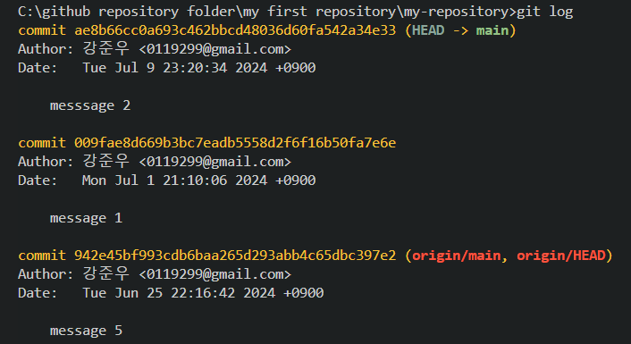
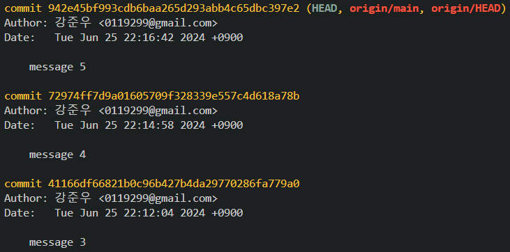

# CLI 버전관리
1. CLI 버전관리란 무엇인가?
2. git log를 치면 나오는 HEAD는 어떤 의미가 있나요?
3. 아래 그림(fig. 1)에서 최신 버전에서 두번째 버전으로 돌아가려면 어떤 명령어를 써야하나요(커밋 메세지가 "message 1"인 버전)
```bash
...
code # 코드 주석
...
```
*fig 1. git log 시 결과* <br>

4. main branch의 최신 버전으로 돌아가려면 어떤 명령어를 써야하나요?
5. HEAD, HEAD -> main(혹은 master)는 어떤 차이가 있나요?

# add 옵션, Editor
1. `git commit -am "message"` 에서 -am은 -a, -m 옵션이 합쳐진 것입니다. 각각은 어떤 의미를 가지는 옵션인지 말해보세요.
2. `git commit -am "message"`에서 -a 옵션은 실수를 방지하기 위한 조건이 있습니다. 조건이 무엇인가요?
3. `git config --global core.editor "vim"`의 뜻을 설명해보세요.

# git reset, revert
1. 위 그림(fig. 1)에서 `git reset --hard 009fae8d669b3bc7eadb5558d2f6f16b50fa7e6e`을 하면 결과가 어떻게 되나요?
2. `git revert 009fae8d669b3bc7eadb5558d2f6f16b50fa7e6e`을 하면 결과가 어떻게 되나요?
3. `git reset ...`과 `git revert ...`는 의미가 비슷한데, 용도에 차이를 두고 사용한다면 어떤 차이가 있나요?

# tag, branch
1. tag는 왜 쓰이고 무엇을 대신하는 건가요?
2. branch는 생성한다는 것은 어떤 의미인가요?

# branch
1. branch는 왜 필요한가요?
2. 아래 fig 2.와 fig 3.의 그림과 커밋을 순서대로 각각 대응 시켰을 때, 두 번째 그림에서 새로운 그림을 그리기 위해 분기(branch)를 생성하려면 어떻게 해야하는 지 코드를 작성해주세요 (HEAD는 맨 위 그림 즉, 최신 버전을 가르치고 있음.) 

 *fig 2.*<br>
 *fig 3.*<br>

3. 각자의 main branch의 최신 버전에서 `dev-{이름} (예: dev-junwoo)`이라는 브랜치를 만들고 (branch가 고장난 것 같으면 `dev-junwoo_1`처럼 만들어도 됩니다.)
4. 이 과제를 작성하고 본인의 remote repository로 push 한 뒤
5. 강준우 repository에 `dev`라는 branch에 PR을 날려보세요. (push가 안될 경우 `git push --set-upstream dev-{이름}`로 push 해보세요.)
6. 다했으면 하는 과정 각각을 스크린샷해서 여기에 올려주세요. 드래그앤 드랍으로 하면 됩니다.

### Advanced
1. HEAD 옆 origin/main, origin/dev, origin/HEAD는 무슨 뜻일지 추측해보세요.
2. `git checkout -b {branch_name}`에서 -b 옵션은 '{branch_name}라는 이름으로 새로운 브랜치를 만든다.' 이 명령어 결과와 같은 결과를 만드는 명령어를 찾아보세요.
3. `git config ...`에서 바꿀 수 있는 다른 명령어들은 무엇이 있나요? 맘에 드는 설정을 바꾼 뒤 알려주세요.
4. `git reset --hard ...`처럼 `git reset`에는 `--hard` `--mixed` `--soft`등 옵션이 있는데 이 옵션이 어떤 차이가 있는지 알려주세요.
5. 자주 사용되는 branch의 이름들이 몇 가지가 있습니다. 어떤 것들이 있고 무슨 이유로 그 branch를 사용하는지 2가지만 알려주세요.

