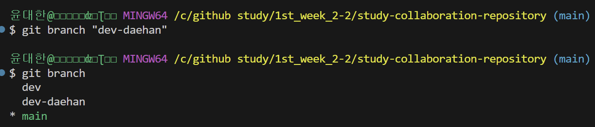
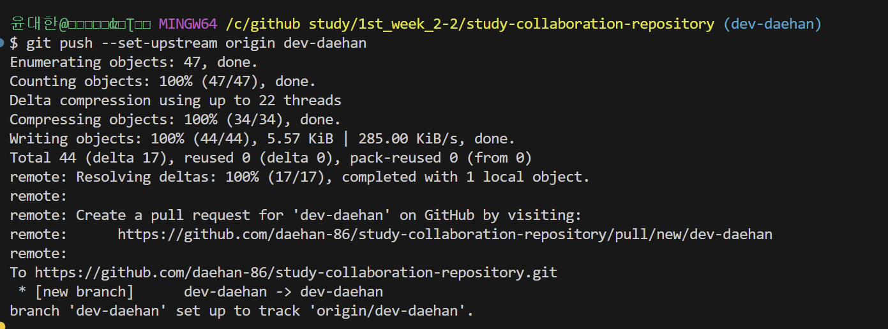

# CLI 버전관리
1. CLI 버전관리란 무엇인가?  
CLI를 사용해서 콘솔화면에서 의미있던 문서의 버전을 기록하거나 불러오는 것이다.
2. git log를 치면 나오는 HEAD는 어떤 의미가 있나요?  
현재 가르키고 있는 commit버전을 의미한다.
3. 아래 그림(fig. 1)에서 최신 버전에서 두번째 버전으로 돌아가려면 어떤 명령어를 써야하나요(커밋 메세지가 "message 1"인 버전)
```bash
...
git checkout 009f
# commit 코드중 맨앞 4개만 써도 이동 가능함.
...
```
*fig 1. git log 시 결과* <br>

4. main branch의 최신 버전으로 돌아가려면 어떤 명령어를 써야하나요?  
```bash
...
git checkout master
# or
git checkout main
# master(main)는 commit중 제일 최신 commit을 의미함.
...
```
5. HEAD, HEAD -> main(혹은 master)는 어떤 차이가 있나요?  
일단 HEAD는 현재 가리키고 있는 커밋의 위치가 HEAD가 써진 커밋에 있다고 알려주는 것이고.  
HEAD -> main은 현재 가리키고 있는 커밋의 위치가 제일 최신 commit에 있다는 것이다.

# add 옵션, Editor
1. `git commit -am "message"` 에서 -am은 -a, -m 옵션이 합쳐진 것입니다. 각각은 어떤 의미를 가지는 옵션인지 말해보세요.  
-a는 all라는 옵션으로 직접 `git add .`를 하지 않아도 수정된 파일을 stage area로 옮겨주고 커밋 할 수 있는 옵션이다.  
-m은 message라는 옵션으로 commit message를 지어주는 옵션이다.  
바로 뒤에 쌍따옴표로 메세지를 작성 해주면 된다.  
2. `git commit -am "message"`에서 -a 옵션은 실수를 방지하기 위한 조건이 있습니다. 조건이 무엇인가요?  
새로 생긴파일이나 git이 관리하고 있지않은, 즉, untracked파일은 추가되지 않는다.  
3. `git config --global core.editor "vim"`의 뜻을 설명해보세요.  
컴퓨터 전체 editor에 대해서 vim으로 설정하겠다는 것임.  

# git reset, revert
1. 위 그림(fig. 1)에서 `git reset --hard 009fae8d669b3bc7eadb5558d2f6f16b50fa7e6e`을 하면 결과가 어떻게 되나요?  
해당 commit은 'message 1'에 해당되는 commit이고, 이 명령어를 사용하면 그보다 최신에 나온 commit들을 다 삭제하고 제일 최신 commit이 message 1으로 바뀌게 된다.  
최신 commit 뿐만아니라 문서도 'message 1'일 때 상태로 돌아간다. 따라서 그냥 저 버전으로 돌아가겠다는 뜻이다.  
2. `git revert 009fae8d669b3bc7eadb5558d2f6f16b50fa7e6e`을 하면 결과가 어떻게 되나요?  
만약 저 사진 상태라면 이 명령어는 수행이 안된다.(맨위인 message 2부터 revert해줘야ㅜ함)  
하지만 1번(reset)을 수행했다 가정했을 때  
이 명령어를 사용하면 해당 commit인 'message 1'의 내용을 되돌린다는 의미로 새로운 commit이 생긴다.  
3. `git reset ...`과 `git revert ...`는 의미가 비슷한데, 용도에 차이를 두고 사용한다면 어떤 차이가 있나요?  
reset은 지금까지의 작업이 필요없고 remote repository에도 올라가지 않았을 때 사용하는 것.  
revert는 지금까지의 작업이 remote에 올라갔으며 이전의 버전으로 돌려야 할 때 사용하는 것.  

# tag, branch
1. tag는 왜 쓰이고 무엇을 대신하는 건가요?  
tag를 사용해서 특정 commit의 ID을 별칭으로 추가해서 굳이 commit ID를 사용하지 않고 별칭으로 관리할 수 있다.  
2. branch는 생성한다는 것은 어떤 의미인가요?  
평행우주를 만든다는 의미이다.  
commit의 history에 여러상태가 공존하는 것이다.  
# branch
1. branch는 왜 필요한가요?  
여러 작은 수정으로 인해 저장소에 여러 commit history가 남는걸 방지하는 것이다.  
2. 아래 fig 2.와 fig 3.의 그림과 커밋을 순서대로 각각 대응 시켰을 때, 두 번째 그림에서 새로운 그림을 그리기 위해 분기(branch)를 생성하려면 어떻게 해야하는 지 코드를 작성해주세요 (HEAD는 맨 위 그림 즉, 최신 버전을 가르치고 있음.)  
```bash
...
git checkout 7297 # HEAD를 두번째 커밋으로 이동
git branch dev # 현재 위치에서 새로운 branch를 만듦
...
```

 *fig 2.*<br>
 *fig 3.*<br>

3. 각자의 main branch의 최신 버전에서 `dev-{이름} (예: dev-junwoo)`이라는 브랜치를 만들고 (branch가 고장난 것 같으면 `dev-junwoo_1`처럼 만들어도 됩니다.)

4. 이 과제를 작성하고 본인의 remote repository로 push 한 뒤

5. 강준우 repository에 `dev`라는 branch에 PR을 날려보세요. (push가 안될 경우 `git push --set-upstream dev-{이름}`로 push 해보세요.)

6. 다했으면 하는 과정 각각을 스크린샷해서 여기에 올려주세요. 드래그앤 드랍으로 하면 됩니다.

### Advanced
1. HEAD 옆 origin/main, origin/dev, origin/HEAD는 무슨 뜻일지 추측해보세요.  
로컬 저장소가 가르키고 있는 branch를 의미한다.  
2. `git checkout -b {branch_name}`에서 -b 옵션은 '{branch_name}라는 이름으로 새로운 브랜치를 만든다.' 이 명령어 결과와 같은 결과를 만드는 명령어를 찾아보세요.  
```bash
...
git switch -c {branch_name} # 최신버전에서만 사용 가능
...
```

3. `git config ...`에서 바꿀 수 있는 다른 명령어들은 무엇이 있나요? 맘에 드는 설정을 바꾼 뒤 알려주세요.

4. `git reset --hard ...`처럼 `git reset`에는 `--hard` `--mixed` `--soft`등 옵션이 있는데 이 옵션이 어떤 차이가 있는지 알려주세요.
5. 자주 사용되는 branch의 이름들이 몇 가지가 있습니다. 어떤 것들이 있고 무슨 이유로 그 branch를 사용하는지 2가지만 알려주세요.

